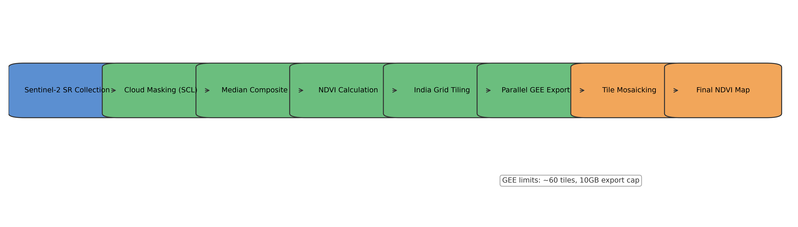

# IITB NDVI Framework

## Project Overview

This project produces a national NDVI map of India from Sentinel-2 surface reflectance (10 m). The pipeline tiles India to manage Google Earth Engine (GEE) limits, exports NDVI per tile, and mosaics the tiles into a final map.

## Architecture

Pipeline stages:
- Sentinel-2 SR filtering and cloud masking (SCL)
- NDVI computation and median compositing
- India grid tiling and batch GEE export
- Local mosaicking and visualization outputs

## Setup Instructions

1. Create and activate a Python environment.
2. Install dependencies:
   - `pip install -r iitb-ndvi-framework/requirements.txt`
3. Authenticate Earth Engine:
   - `python iitb-ndvi-framework/main.py`

## Usage

1. Generate tiles and manifest:
   - `python iitb-ndvi-framework/tiling.py`
2. Submit exports and monitor tasks:
   - `python iitb-ndvi-framework/export_manager.py`
3. Mosaic and visualize outputs:
   - `python iitb-ndvi-framework/mosaic_visualize.py`

## Scalability Notes

- Tiling keeps per-export payloads within GEE memory and export limits.
- Batch exports are monitored and failed tiles can be retried.
- Mosaic and visualization steps are handled locally after all tiles finish.

## Limitations & Future Work

- Export throughput depends on GEE queue capacity.
- Cloud masking can be extended with S2 cloud probability products.
- Add automated QA metrics and reporting for reproducibility.
